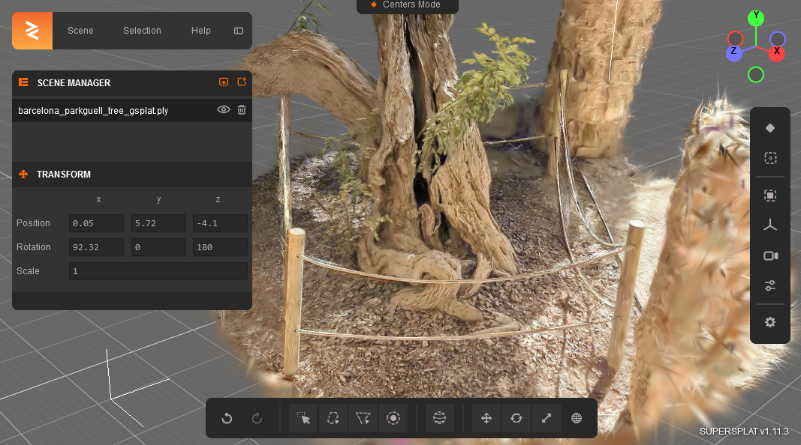
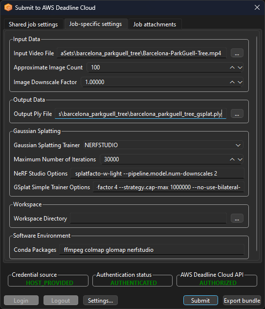
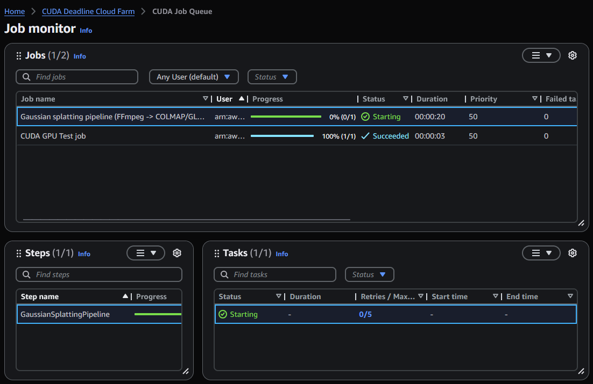
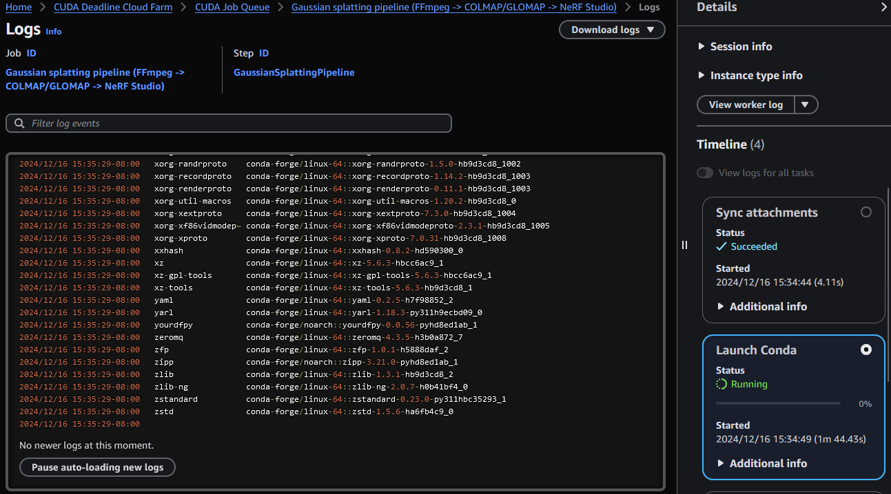
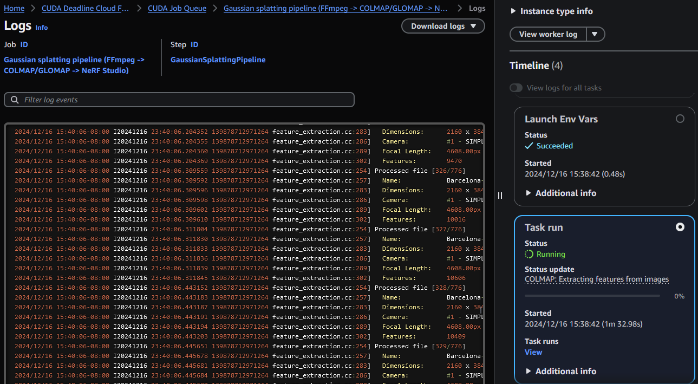
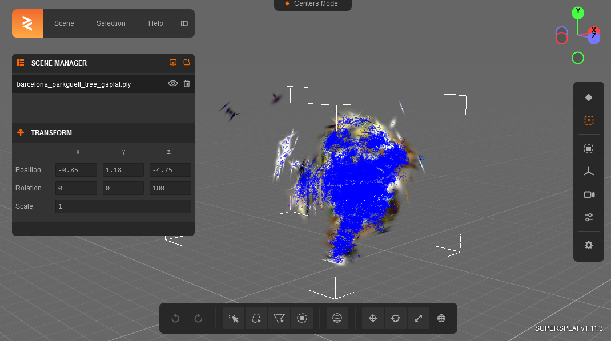
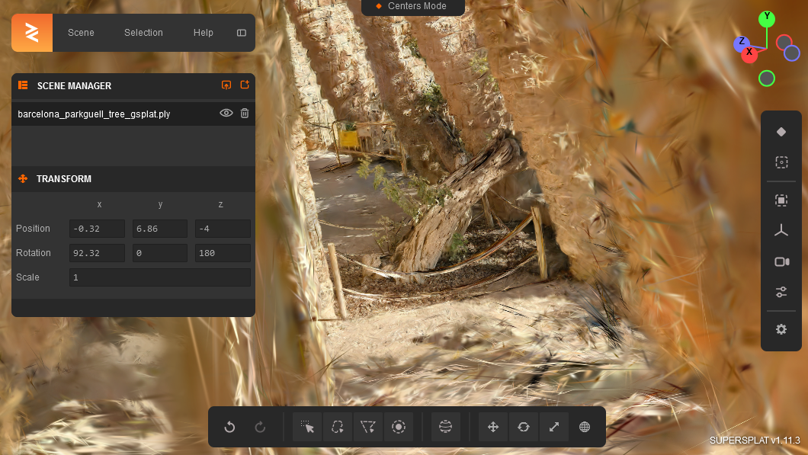
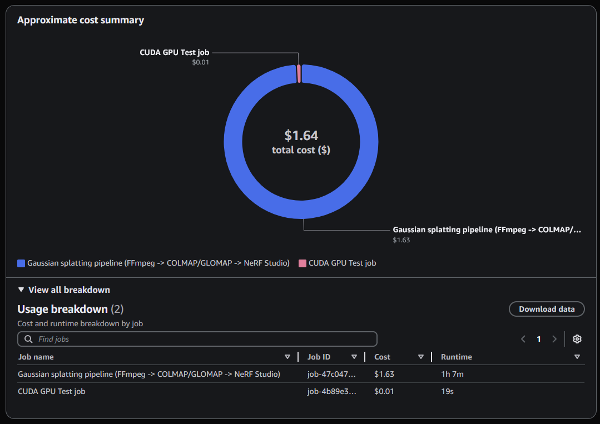

# Gaussian Splatting pipeline for AWS Deadline Cloud

## Introduction

This job bundle runs a [3D Gaussian Splatting pipeline](https://aws.amazon.com/blogs/spatial/3d-gaussian-splatting-performant-3d-scene-reconstruction-at-scale/).
In a few hours, you can train your own Gaussian Splatting point cloud from a video by following the instructions in the prerequisites
and this README. The job bundle takes a video file as input, and produces a Gaussian Splatting .ply file as output.

The pipeline consists of a single task that runs scripts to:

1. Extract video frames with [FFmpeg](https://www.ffmpeg.org/).
2. Solve Structure-from-Motion with [COLMAP](https://colmap.github.io/)
   and [GLOMAP](https://github.com/colmap/glomap#readme), saving the pinhole model and undistorted images
3. Train Gaussian Splatting with [NeRF Studio splatfacto](https://docs.nerf.studio/nerfology/methods/splat.html),
   [Splatfacto in the Wild](https://docs.nerf.studio/nerfology/methods/splatw.html), or the
   [simple_trainer.py gsplat library example](https://docs.gsplat.studio/main/examples/colmap.html).
   Output is saved to the .ply output specified.

After downloading the output, you can view it in any Gaussian Splatting viewer such as [SuperSplat](https://github.com/playcanvas/supersplat#readme).



[In the last section](#next-steps), you'll find some ideas for next steps after trying out this sample. You can remix
the sample to customize your own 3D reconstruction pipeline, or follow the same patterns to run different CUDA workloads
on your Deadline Cloud CUDA farm.

## Prerequisites

1. Create an [AWS account](https://aws.amazon.com/resources/create-account/) if you do not already have one.
2. Follow the [CUDA farm sample CloudFormation template README](../../cloudformation/farm_templates/cuda_farm/README.md)
   instructions to create a Deadline Cloud farm that has a CUDA GPU fleet and can build conda packages. You will
   run the Gaussian Splatting job on this farm.
3. Follow the [NeRF Studio sample conda package recipe README](../../conda_recipes/nerfstudio/README.md) instructions
   to build a [NeRF Studio](https://docs.nerf.studio/) conda package into the S3 channel of your
   CUDA farm.

Now you just need a video that captures many viewpoints of a subject to reconstruct in 3D,
and then you can run the Gaussian Splatting pipeline on your farm.

## Capture a video of a subject

You can use a video-capable camera like your smartphone to capture a video of a subject for your Gaussian Splatting.
Here are some tips to consider:

1. Use a wide field of view, for example zoom level 0.5 in your camera app. With a wider field of view, more
   objects will be common between image pairs for Structure-from-Motion to use.
2. Turn off video stabilization. This preserves identical lens optics between all frames, and can increase the
   quality of solves.
3. Plan your camera motion depending on the subject.
    1. To capture an object, like a bench or a bicycle, orbit around the the subject several times.
       Keep the camera at a different height each time and if possible at different distances from the subject.
    2. To capture a room interior, follow around the outside of the room with the camera facing inwards.
       Repeat at different camera heights, and if there are particular objects that you want at higher detail
       treat them like an object capture.
    3. To capture less structured spaces such as outside terrain, think about how to include everything you want
       in your Gaussian Splatting, and how to capture all of it from multiple different angles.
4. Capture the video with slow and steady motion.
5. Keep moving the camera, avoid stopping and panning from a single location.

Copy the video you captured from your camera to your computer for submitting to the farm.

## Submit the gsplat_pipeline job

If you don't have a local copy of [deadline-cloud-samples](https://github.com/aws-deadline/deadline-cloud-samples)
GitHub repository, you can make a git clone or
[download it as a ZIP](https://github.com/aws-deadline/deadline-cloud-samples/archive/refs/heads/mainline.zip).

From the `job_bundles` directory of `deadline-cloud-samples`, run the following command:

```
$ deadline bundle gui-submit gsplat_pipeline
```

Switch to the "Job-specific settings" tab and select paths for both the "Input Video File" and the "Output Ply File".



You can proceed to select the "Submit" button, or customize the settings first. If the input video has higher complexity,
you may need to increase the "Approximate Image Count" value.

You can also select which Gaussian Splatting trainer to use and customize the CLI options to it. If you want to
use the Monte Carlo Markov chain (MCMC) trainer with the bilateral grid option to produce up to 2 million splats,
make the following changes:

1. Switch the Gaussian Splatting Trainer from NERFSTUDIO to GSPLAT_SIMPLE_TRAINER.
2. Modify the GSplat Simple Trainer Options text from `--strategy.cap-max 1000000` to `--strategy.cap-max 2000000`
   to get 2 million splats, and from `--no-use-bilateral-grid` to `--use-bilateral-grid` to enable the bilateral
   grid option.

**_NOTE:_** If you select an input video or options that require higher memory usage than the CUDA fleet provides,
you will need to update the fleet's minimum settings by re-deploying your CloudFormation template with updated
parameter values or editing the settings from the AWS Deadline Cloud management console.

## Monitor the gsplat_pipeline job

Once the job is submitted, you can monitor its status from the Deadline Cloud monitor job table. Depending on the
input video and the settings you selected, the job could be done in 10 minutes or it could take hours.



When the job is running, you can right click on the task and select "View logs" to open
the log view:



As the pipeline goes through its steps, it will update the status message visible in the task run details:



If you encounter errors, the log output in this view will help you track down the cause. You can identify
which part of the pipeline failed, as it could be an issue with FFmpeg processing the input video, GLOMAP
solving Structure-from-Motion, or NeRF Studio training the Gaussian splats. Then you can hone in on the specific
errors, such as running out of memory or being unable to solve for the camera poses. The answer may be to
adjust the fleet infrastructure if you want to keep the settings you selected, or to change the parameters
to reduce the image resolution, count or something else.

## Download and view the Gaussian Splatting .ply

When the job completes successfully, you can download its output from Deadline Cloud monitor. Right click
on the completed task in the Tasks table and select "Download output". Depending on your settings, it may
show the download progress in your browser, or present a CLI command you can use to download.

The .ply file will be saved to the location you selected when submitting the job. To view the result
in your browser, open the [SuperSplat Editor](https://superspl.at/editor) website and drag/drop
the file from your operating system's file browser onto the SuperSplat page. The initial view
will look something like this:



After toggling the Show/Hide Splats option on the right, rotating the scene by about ninety degrees,
and navigating around the scene, here's the subject of the capture:



With SuperSplat, you can edit your Gaussian Splatting. Here's the result of selecting a sphere,
inverting the selection, and deleting those splats:


There are many tutorials and [documentation pages](https://github.com/playcanvas/supersplat/wiki) to learn how to use SuperSplat,
or import your .ply file into your tool of choice.

## Understand the cost of your training jobs

Deadline Cloud monitor includes a usage explorer feature that can estimate the cost of the jobs you run
and help you understand how much each training costs. For the sample, I trained at higher quality with a larger
number of images than default and the Structure-from-Motion and training took about an hour. The example costs
shown here are for an on-demand CUDA fleet. If you're comfortable running your tests on off-peak hours when
CUDA-capable instances are available with low enough interruption rates, you could use a spot CUDA fleet
at reduced cost. What is shown in usage explorer does not include costs outside of your job run time, such as idle worker
instance time or storage on your S3 bucket.



## This sample is a starting point<a id='next-steps'></a>

You can get good mileage out of the gsplat_pipeline job as it is, but we created it to be
pulled apart, edited, and remixed.

### Run the job anywhere with the Open Job Description CLI

Following the spirit of the Open Job Description
[Design Tenets](https://github.com/OpenJobDescription/openjd-specifications/wiki/Design-Tenets),
the job template in this bundle is portable. You can run it locally using the [openjd CLI](https://github.com/OpenJobDescription/openjd-cli#readme)
tool, installable into your Python via `pip install openjd-cli`. See the
[Introduction to Creating a Job](https://github.com/OpenJobDescription/openjd-specifications/wiki/Introduction-to-Creating-a-Job)
documentation for some ideas on local development setup.

I created an EC2 instance using the [AWS deep Learning AMI with Conda](https://docs.aws.amazon.com/dlami/latest/devguide/overview-conda.html),
and set the conda channel configuration to exclude defaults and instead use `s3://<my-conda-channel-bucket>/Conda/Default`
and `conda-forge`. The S3 conda channel contains a `nerfstudio` package created from
[NeRF Studio sample conda package recipe README](../../conda_recipes/nerfstudio/README.md). Then I ran `pip install openjd-cli`
before running the following command:

```
$ openjd run gsplat_pipeline/template.yaml \
      --environment ../queue_environments/conda_queue_env_improved_caching.yaml \
      -p InputVideoFile=~/videos/My3DCaptureVideo.mp4 \
      -p OutputPlyFile=vw.ply \
      -p WorkspaceDir=my_workspace
0:00:00.000032  Open Job Description CLI: Session start 2025-03-19T01:46:35.324305+00:00
0:00:00.000084  Open Job Description CLI: Running job 'Gaussian Splatting pipeline (FFmpeg -> COLMAP/GLOMAP -> NeRF Studio)'
0:00:00.000151
0:00:00.000197  ==============================================
0:00:00.000241  --------- Entering Environment: Conda
0:00:00.000274  ==============================================
...
```

Instead of relying on the conda queue environment via the `--environment` option, you could install all
the necessary software with a different method. In that case, you can run the following:

```
$ openjd run gsplat_pipeline/template.yaml \
      -p InputVideoFile=~/videos/My3DCaptureVideo.mp4 \
      -p OutputPlyFile=vw.ply \
      -p WorkspaceDir=my_workspace
```

The [conda_queue_env_improved_caching.yaml](../../queue_environments/README.md#conda-queue-environment-with-improved-caching)
has some features to help you manage the software environment in a relatively hands-free way. It was added to your
Deadline Cloud queue when you deployed the CUDA farm CloudFormation as well, and these features apply both there and here.
By default, it will take the hash of the values for its parameters CondaPackages and CondaChannels, and generate
an automatic environment name like `hashname_04bcf28cb135f7f82cfc27a3` as visible in this part of the output:

```
...
0:00:00.004261  Using an automatic name for the Conda environment, based on the hash of these values:
0:00:00.004324    CondaChannels: deadline-cloud
0:00:00.004378    CondaPackages: ffmpeg colmap=*=gpu* glomap nerfstudio
0:00:00.006468  Automatic name is hashname_04bcf28cb135f7f82cfc27a3
0:00:00.745875  Named Conda environment hashname_04bcf28cb135f7f82cfc27a3 not found, creating it.
0:00:02.154582  Channels:
0:00:02.154705   - deadline-cloud
0:00:02.154765   - s3://<my-conda-channel-bucket>/Conda/Default
0:00:02.154850   - conda-forge
0:00:02.154903  Platform: linux-64
0:00:10.723394  Collecting package metadata (repodata.json): ...working... done
0:00:16.072905  Solving environment: ...working... done
0:00:16.173576
0:00:16.173668  ## Package Plan ##
0:00:16.173723
0:00:16.173781    environment location: /home/ssm-user/.conda/envs/hashname_04bcf28cb135f7f82cfc27a3
0:00:16.173827
0:00:16.173868    added / updated specs:
0:00:16.173910      - colmap[build=gpu*]
0:00:16.173984      - ffmpeg
0:00:16.174032      - glomap
0:00:16.174072      - nerfstudio
...
```

After solving, downloading, and installing packages in the environment, the task will run:

```
...
0:02:39.971583  ==============================================
0:02:39.971612  --------- Running Task
0:02:39.971639  ==============================================
0:02:39.971911  ----------------------------------------------
0:02:39.971982  Phase: Setup
0:02:39.972014  ----------------------------------------------
0:02:39.972047  Writing embedded files for Task to disk.
0:02:39.972101  Mapping: Task.File.Run -> /tmp/OpenJD/CLI-sessiona31itehh/embedded_filesnrdfvegi/gaussian_splatting_pipeline.sh
0:02:39.972219  Wrote: Run -> /tmp/OpenJD/CLI-sessiona31itehh/embedded_filesnrdfvegi/gaussian_splatting_pipeline.sh
0:02:39.972491  ----------------------------------------------
0:02:39.972541  Phase: Running action
0:02:39.972576  ----------------------------------------------
0:02:39.972718  Running command /tmp/OpenJD/CLI-sessiona31itehh/tmpxvvkdhmo.sh
0:02:39.973248  Command started as pid: 4796
0:02:39.973299  Output:
0:02:39.975015  + cd /home/ssm-user/deadline-cloud-samples/job_bundles/my_workspace
0:02:39.975091  + extract_video_frames.sh /home/ssm-user/videos/My3DCaptureVideo.mp4 100 1.0 ./source_images
...
```

After the task is finished running, the queue environment exit action will run to inspect all the automatic
conda virtual environments, and clean any that are older than 96 hours:

```
...
0:23:48.570419  Cleaning up any automatically-named conda environments that weren't updated within 96 hours.
0:23:49.239172  Checking environment hashname_04bcf28cb135f7f82cfc27a3
0:23:50.411900  Created hashname_04bcf28cb135f7f82cfc27a3 env at 2025-03-20T04:49+00:00
0:23:50.412049    CondaChannels: deadline-cloud
0:23:50.412108    CondaPackages: ffmpeg colmap=*=gpu* glomap nerfstudio
0:23:50.423921  Environment was last updated 0 hours ago.
...
```

Now, if you run the job again, maybe with different training parameters:

```
$ openjd run gsplat_pipeline/template.yaml \
      --environment ../queue_environments/conda_queue_env_improved_caching.yaml \
      -p InputVideoFile=~/videos/My3DCaptureVideo.mp4 \
      -p OutputPlyFile=vw_mcmc.ply \
      -p WorkspaceDir=my_workspace_mcmc \
      -p GaussianSplattingTrainer=GSPLAT_SIMPLE_TRAINER \
      -p GSplatSimpleTrainerOptions="mcmc --use-bilateral-grid"
```

it will use the conda virtual environment created before:

```
...
0:00:00.004263  Using an automatic name for the Conda environment, based on the hash of these values:
0:00:00.004331    CondaChannels: deadline-cloud
0:00:00.004383    CondaPackages: ffmpeg colmap=*=gpu* glomap nerfstudio
0:00:00.006411  Automatic name is hashname_04bcf28cb135f7f82cfc27a3
0:00:00.714230  Reusing the existing named Conda environment hashname_04bcf28cb135f7f82cfc27a3.
...
```

and start running the task much sooner:

```
0:00:08.836003  + cd /home/ssm-user/deadline-cloud-samples/job_bundles/my_workspace_mcmc
0:00:08.836097  + extract_video_frames.sh /home/ssm-user/videos/My3DCaptureVideo.mp4 100 1.0 ./source_images
```

### Decompose the pipeline into Open Job Description steps

In the [job template](template.yaml), the whole pipeline runs as single script for an Open Job Description step.
This style of pipeline either runs to the end, or not at all, and it will always run serially on one worker host.
By splitting it up into individual Open Job Description steps, you can run part of the job on a CPU-only host,
and the rest of the job on a GPU host. It also gives you the opportunity to introduce cluster parallelism by adding a
parameter space to a step that can process the data as independent steps on many different machines.

The sample [Job Development Progression](../job_dev_progression/) illustrates the pattern to follow, using two steps.
One to initialize a workspace, and a second to perform data processing. To do the same for the Gaussian Splatting
pipeline, start by changing the WorkspaceDir parameter from optional to required, and give it a default value.
For [Deadline Cloud job attachments](https://docs.aws.amazon.com/deadline-cloud/latest/developerguide/run-jobs-job-attachments.html)
to copy data in the workspace between the worker hosts running steps of the job, it must be in a directory with specified
data flow instead of in the session directory. The parameter should look something like this after your edit:

```yaml
# Workspace
- name: WorkspaceDir
  description: This path is used for the pipeline's workspace.
  userInterface:
    control: CHOOSE_DIRECTORY
    label: Workspace Directory
    groupLabel: Workspace
  type: PATH
  objectType: DIRECTORY
  dataFlow: OUT
  default: workspace
  minLength: 1
```

To understand how to the different steps will interact with each other, it's useful to first inspect the workspace
contents of a successful job run. You will find that the different model trainers use slightly different directory
structure. The job bundle includes a Python script that summarizes the files, collapsing sequences of numbered frames.
Here is log output from a simple_trainer mcmc run from after each of the three scripts.

For the script `1. Extract video frames`:

```
          extract_video_frames.sh \
                  '{{Param.InputVideoFile}}' \
                  {{Param.ApproxImageCount}} \
                  {{Param.ImageDownscaleFactor}} \
                  ./source_images

2025/03/18 17:50:53-07:00 Summary of workspace directory .
2025/03/18 17:50:53-07:00  source_images/My3DCaptureVideo_#.jpg
2025/03/18 17:50:53-07:00     With 99 indexes: 1-99
```

For the script `2. Solve Structure-from-Motion, saving the pinhole model and undistorted images`:

```
          solve_glomap_sfm.sh \
                  ./source_images \
                  ./sfm_workspace \
                  ./sparse \
                  ./images

2025/03/18 17:51:32-07:00 Summary of workspace directory .
2025/03/18 17:51:32-07:00  images/My3DCaptureVideo_#.jpg
2025/03/18 17:51:32-07:00     With 99 indexes: 1-99
2025/03/18 17:51:32-07:00  sfm_workspace/database.db
2025/03/18 17:51:32-07:00  sfm_workspace/sparse/0/cameras.bin
2025/03/18 17:51:32-07:00  sfm_workspace/sparse/0/images.bin
2025/03/18 17:51:32-07:00  sfm_workspace/sparse/0/points3D.bin
2025/03/18 17:51:32-07:00  source_images/My3DCaptureVideo_#.jpg
2025/03/18 17:51:32-07:00     With 99 indexes: 1-99
2025/03/18 17:51:32-07:00  sparse/cameras.bin
2025/03/18 17:51:32-07:00  sparse/images.bin
2025/03/18 17:51:32-07:00  sparse/points3D.bin
```

For the script `3. Train Gaussian Splatting, saving the .ply output`:

```
            train_gsplat_simple_trainer.sh \
                     . \
                     '{{Param.MaxNumIterations}}' \
                     '{{Param.OutputPlyFile}}' \
                     {{Param.GSplatSimpleTrainerOptions}}

2025/03/18 17:55:01-07:00 Summary of workspace directory .
2025/03/18 17:55:01-07:00  gsplat_workspace/cfg.yml
2025/03/18 17:55:01-07:00  gsplat_workspace/ckpts/ckpt_6999_rank0.pt
2025/03/18 17:55:01-07:00  gsplat_workspace/ckpts/ckpt_9999_rank0.pt
2025/03/18 17:55:01-07:00  gsplat_workspace/ply/point_cloud_9999.ply
2025/03/18 17:55:01-07:00  gsplat_workspace/renders/val_step6999_#.png
2025/03/18 17:55:01-07:00     With 13 indexes: 0-12
2025/03/18 17:55:01-07:00  gsplat_workspace/stats/train_step6999_rank0.json
2025/03/18 17:55:01-07:00  gsplat_workspace/stats/train_step9999_rank0.json
2025/03/18 17:55:01-07:00  gsplat_workspace/stats/val_step6999.json
2025/03/18 17:55:01-07:00  gsplat_workspace/tb/events.out.tfevents...us-west-2.compute.internal
2025/03/18 17:55:01-07:00  gsplat_workspace/videos/traj_6999.mp4
2025/03/18 17:55:01-07:00  images/My3DCaptureVideo_#.jpg
2025/03/18 17:55:01-07:00     With 99 indexes: 1-99
2025/03/18 17:55:01-07:00  images/frame_#.jpg
2025/03/18 17:55:01-07:00     With 99 indexes: 1-99
2025/03/18 17:55:01-07:00  images_2/frame_#.jpg
2025/03/18 17:55:01-07:00     With 99 indexes: 1-99
2025/03/18 17:55:01-07:00  images_4/frame_#.jpg
2025/03/18 17:55:01-07:00     With 99 indexes: 1-99
2025/03/18 17:55:01-07:00  images_4_png/My3DCaptureVideo_#.png
2025/03/18 17:55:01-07:00     With 99 indexes: 1-99
2025/03/18 17:55:01-07:00  images_4_png/frame_#.png
2025/03/18 17:55:01-07:00     With 99 indexes: 1-99
2025/03/18 17:55:01-07:00  images_8/frame_#.jpg
2025/03/18 17:55:01-07:00     With 99 indexes: 1-99
2025/03/18 17:55:01-07:00  sfm_workspace/database.db
2025/03/18 17:55:01-07:00  sfm_workspace/sparse/0/cameras.bin
2025/03/18 17:55:01-07:00  sfm_workspace/sparse/0/images.bin
2025/03/18 17:55:01-07:00  sfm_workspace/sparse/0/points3D.bin
2025/03/18 17:55:01-07:00  source_images/My3DCaptureVideo_#.jpg
2025/03/18 17:55:01-07:00     With 99 indexes: 1-99
2025/03/18 17:55:01-07:00  sparse/cameras.bin
2025/03/18 17:55:01-07:00  sparse/images.bin
2025/03/18 17:55:01-07:00  sparse/points3D.bin
2025/03/18 17:55:01-07:00  sparse_pc.ply
2025/03/18 17:55:01-07:00  transforms.json
```

Observe how the workspace contains sub-workspaces for different processes it runs, and data in
directories like `source_images`, `sparse`, and `images` that were shared between them.
If you want to optimize the amount of data transfer, you can put these sub-workspaces in the session directory,
and only put data to share in the workspace that gets copied. To keep things simple, we'll stick to
the existing structure.

Edit the template from having a single step in the `steps` list:

```yaml
steps:

- name: GaussianSplattingPipeline
  script:
    ...
```

to have three sequential steps connected by dependencies, named for the scripts they run:

```yaml
steps:

- name: ExtractVideoFrames
  script:
    ...
- name: SolveStructureFromMotion
  dependencies:
  - dependsOn: ExtractVideoFrames
  script:
    ...
- name: TrainGaussianSplatting
  dependencies:
  - dependsOn: SolveStructureFromMotion
  script:
    ...
```

For each step, copy the whole structure but keep a subset of the embedded script. Here's the SfM step,
the rest we'll leave as an exercise for the reader.

```yaml
- name: SolveStructureFromMotion
  dependencies:
  - dependsOn: ExtractVideoFrames
  script:
    actions:
      onRun:
        command: bash
        args: ['{{Task.File.Run}}']
    embeddedFiles:
      - name: Run
        filename: solve_sfm.sh
        type: TEXT
        data: |
          #!/bin/env bash
          set -xeuo pipefail
          cd "$WORKSPACE_DIR"

          # 2. Solve Structure-from-Motion, saving the pinhole model and undistorted images
          solve_glomap_sfm.sh \
                  ./source_images \
                  ./sfm_workspace \
                  ./sparse \
                  ./images

          echo "openjd_status: Finished solving SfM"
  hostRequirements:
    attributes:
      - name: attr.worker.os.family
        anyOf:
        - linux
    amounts:
      - name: amount.worker.gpu
        min: 1
```

When you run this job, it will run slower due to scheduling and data transfer overhead between the steps.
On the other hand, it's organized to schedule on different fleets by editing the `hostRequirements` of
each step, or [add task parallelism](https://github.com/OpenJobDescription/openjd-specifications/wiki/Job-Intro-03-Creating-a-Job-Template#4-adding-task-parallelism)
to a step that can be split up into many identical tasks.

### Split into multiple jobs with different structure

The right job structure will depend on how you use the job. Here are some more directions you might take it:

* One job to extract frames and solve Structure-from-Motion. A second job that trains the Gaussian Splatting.
  With this structure, you can preprocess into camera poses once, after which you iteratively try different
  variations of Gaussian Splatting parameters.
* A job to train Gaussian Splatting that optionally starts from an existing workspace, and continues training it.
  This way, you can run one job to train initial lower quality versions, and then select the best candidates
  for continued training after visually inspecting them.
* Add steps between frame extraction and Structure-from-Motion that removes blurry images from the workspace,
  calculates masks to remove the background or people, etc.